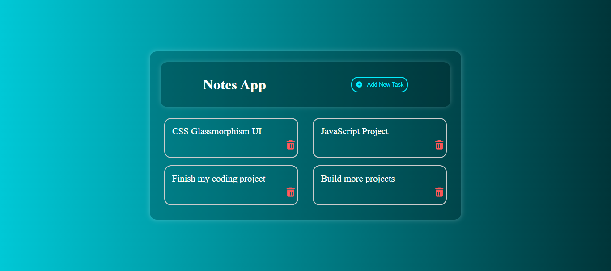

# 📝 Glassmorphism Notes App  

A beautiful **Notes App** built with **HTML, CSS, and JavaScript** featuring a modern **Glassmorphism UI**.  
This beginner-friendly project allows users to create, edit, and delete notes with a stylish frosted-glass design.  

---

## ✨ Features  
- 📌 Add, edit, and delete notes easily  
- 🎨 Stunning **Glassmorphism UI design**  
- ⚡ Responsive and beginner-friendly code  
- 🗑️ Delete notes with a single click  
- 🔥 Smooth hover and transition effects  

---

## 🚀 Tech Stack  
- **HTML5** – Structure  
- **CSS3** – Styling with Glassmorphism effect  
- **JavaScript (ES6)** – Functionality  

---

## 📂 Project Structure  
notes-app/

│── index.html # Main HTML file

│── style.css # Styling (Glassmorphism UI)

│── script.js # JavaScript functionality

---

## 📸 Screenshots  
### Main UI  
 

---

## 🤝 Contributing  
Want to improve this project? Fork it, make your changes, and submit a pull request 🚀  

---

## ⭐ Support  
If you like this project, don’t forget to **star ⭐ the repo** and **subscribe to [DevCraft Project](#)** on YouTube for more projects!  
